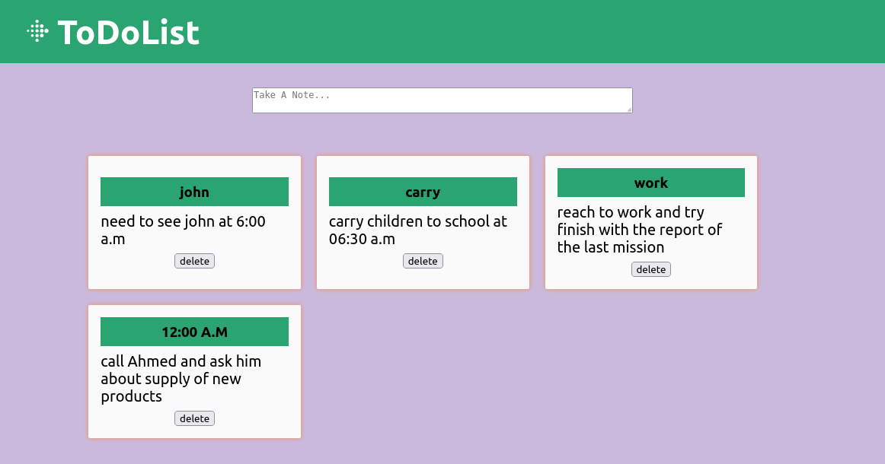
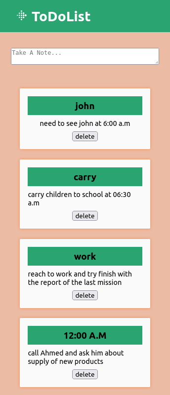

# To Do List App

Sideland : **## To Do List Application**

> ### Overview :

- Schedule a plan for what you should do every single that pass helps better build strong behaviours to become someone who achieve great things. ToDo List App help you plan your actions, or tasks through the day. This application remind you of each previous step you have taken and the next step you need to dive in.

## Interest

You might want to spot how to use:

- -useState Hook one of the most used state of react using destructuring syntax of javascript
  like example:
  const [notes, setNotes] = useState(() => {
  return JSON.parse(localStorage.getItem("list-notes")) ?? [];
  });

- -useEffect Hook used for updating additional codes REACT-DOM everytime some change apply to a specific variable or group of
- use here to update DoM and store variable in LocalStorage
  useEffect(() => {
  localStorage.setItem("list-notes", JSON.stringify(notes));
  }, [notes]);

### Links

- Solution URL: [https://github.com/BeinRain06/todo-list-app.git](https://github.com/BeinRain06/todo-list-app.git)
- Live Site URL: [https://beinrain06.github.io/todo-list-app/](https://beinrain06.github.io/todo-list-app/)

## Description : \* challenge issue

- i faced difficulty to update `notes` using the function `setNotes` from useState() to store new value for our input[name="title"] and textarea[name="content"], finally got that destructuring value written like :
- const {name, value}= event.target means in fact calling variables named **name** and **value** to be equal to properties :
- `event.target.name` and `event.target.value`
- and also that affecting variable [name] in `setNotes` function will affect the name property of object initially declared in useState hook :
- > const handleChange = (event) => {
  > const { name, value } = event.target;
  > setNote((prevNote) => {
      return { ...prevNote, [name]: value };
  });
  };
- i encounter also difficulty when setting button `delete` to operate to remove cartNote from the DOM as i was affecting directly the array `notes` with the **filter()** method of javascript instead of doing the following by wrapping all my function filter() array `notes` in the only function here capable to affect the re-render of array `notes` which is `setNotes` **function**. Like this:
- > const deleteCard = (id) => {
  > setNotes((prevNotes) => {
      return prevNotes.filter((note, index) => {
        return index !== id;
      });
  });
  };

## CSS Structures:

> - <App/> Component , three main components :
>
> -<Header/> -<FormArea/> -<ListNotes/>

**Picture**

---

---

# What I learned

### React Hook Enhanced

**_useState Hook_** one of the most used state of react using destructuring syntax of javascript
_like example_: const[favourites, setFavourites] = useState([]);
_ favourites : is a variable
_ setFavourites : function to change the above variable (favourites)
_ [] : empty array - initial state value of _ favourites \*

>

**_useEffect Hook_** used for updating additional codes REACT-DOM everytime some change apply to a specific variable or group of set variables is passed in a second parameter as `array` (ex: [], [data], [data, searchValue], ...)

- _sample_ : useEffect(Callback function, [state])

* **example**: useEffect(() => {fetchMovies(searchValue)}, [searchValue]);

  > tip : don't use any **return** inside the useEffect Hook

> fetchMovies(searchvalue) : function fecthMovies with argument -searchvalue
> [searchValue] : var _searchValue_ that makes re-render of REACT-DOM whenvever its change.

### javaScript Enhanced

- **map()** method javascript returns a new Array with value passed as argument when looping at an array

  > e.g: const myMovies = movies.map((movie) => {

                     return (
                       <MovieCart key={movie.imdbID} movie={movie}/>
                     )
                   });

- **filter()** method javascript returns a nez array with value that meet conditions returned inside
  > e.g: const newFavourite = favourites.filter((favourite) => favourite.imdbID !== movie.imdbID );

### utilities Materials:

    -Materials icons [https://mui.com/material-ui/material-icons/](https://mui.com/material-ui/material-icons/)

### Mobile Responsiveness

    - Mobile reponsiveness for mobile max-width: 475px ,max-width: 715px,

**Picture**

---

---

## Callback History:

- Age of computer. The electronic organizer was very popular in years 1990's before the avent of computer and smartphone. Replacing paper organizer helps to store calendar, address book , make planification of some specific work, organize our tasks in one right portable device. No need to write all of our schedule in sevral pieces of paper that could be lost but to designed program installed in the electronic organizer,to keep all our intend.
  Now is the world of smartphone and area of AI where virtual things are set like real things, but we remind how helpful it is very simple can;t get virus, stable, don;t need updation to work , handy. Brief if you plan o have a secure schedule in one device you might think of an electronic organizer, all the functions inside meets our need o organize with ease small task of our daily baisis.

**1975**. \_The first electronic organizer replacing _paper-based personal organizer_ was invented
by indian businessman Satyan Pitroda
with a LCD screen and a alpha-numeric keypad

## Useful Resources :

Copycat : ['https://www.copycat.dev/blog/react-localstorage/'] : helps me make my localstorage item persist in my website app

## Acknowledge:

This project always remember the Team :

-Brad Traversy: enlight our javascript underanstang of to-do-app project.

-Sufa Digital: udemy with his light how to achieve our project

## Author

- Frontend Mentor - [https://www.frontendmentor.io/profile/BeinRain06](https://www.frontendmentor.io/profile/BeinRain06)
- Twitter - [https://twitter.com/nest_Ngoueni](https://twitter.com/nest_Ngoueni)
